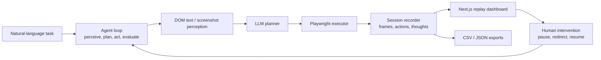

# AutoBrowserAgent Architecture



## Evidence Fixtures

Run the offline replay generator:

```bash
node examples/offline_replay_fixture.mjs
```

It writes a saved session under `examples/saved_sessions/shopping-comparison/` plus exported artifacts under `results/shopping-comparison/`.
